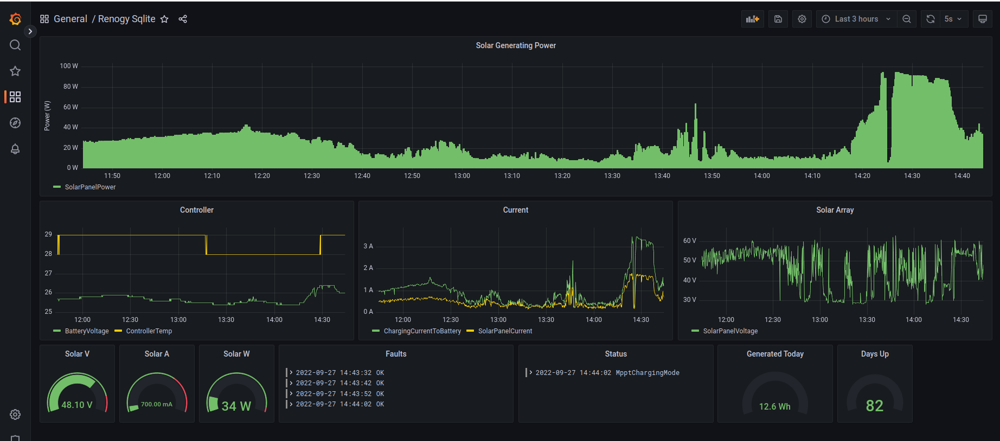

# Solar Controller Client

Kotlin native app which communicate with Renogy Rover 40A over a RS232 serial port, using the Rover Modbus protocol.

Licensed under the MIT license.

## Intended use

Intended to be running on a Raspberry PI. The Raspberry PI needs to be connected over USB/RS232 adapter
to a RS232/RJ12 port of Renogy Rover. This program will periodically show the newest data on screen,
or optionally append the newest data to a CSV file,
which you can inspect to see the performance of your solar array.

For exact instructions on how to connect Renogy Rover RS232/RJ12 over an USB adapter to your Raspberry PI, please see
[NodeRenogy](https://github.com/mickwheelz/NodeRenogy).

You can use Grafana and the sqlite plugin to read the sqlite log database and show charging data in charts:



## Help

Run:

```bash
$ ./solar-controller-client.kexe -h

Usage: solar-controller-client options_list
Arguments: 
    device -> the file name of the serial device to communicate with, e.g. /dev/ttyUSB0 . Pass in `dummy` for a dummy Renogy client { String }
Options: 
    --status -> print the Renogy Rover status as JSON to stdout and quit 
    --utc -> dump date in UTC instead of local, handy for Grafana 
    --csv -> appends status to a CSV file, disables stdout status logging { String }
    --sqlite -> appends status to a sqlite database, disables stdout status logging { String }
    --statefile -> overwrites status to file other than the default 'status.json' { String }
    --pollinginterval, -i -> in seconds: how frequently to poll the controller for data, defaults to 10 { Int }
    --prunelog -> prunes log entries older than x days, defaults to 365 { Int }
    --help, -h -> Usage info 
```

# Running

Example which will log dummy data periodically into the sqlite database:

```bash
$./solar-controller-client.kexe --sqlite log.db dummy
```

To see the data, simply run
```bash
$ sqlite3 log.db "select * from log"
```

To connect to an actual device, pass in the device file name of tty connected to the Renogy, e.g.

```bash
$ solar-controller-client.kexe /dev/ttyUSB0 --status
```

That will cause the app will only print status and quit. To continuously poll the device for data, run

```bash
$ solar-controller-client.kexe --sqlite log.db /dev/ttyUSB0
```

The program will overwrite `status.json` file with the new data polled from the device;
the program will also start appending the information to a sqlite database `log.db` so that you have historic data.
You can also pass in `--csv log.csv` to have the data in text form.

The status JSON example:
```json
{
    "systemInfo": {
        "maxVoltage": 24,
        "ratedChargingCurrent": 40,
        "ratedDischargingCurrent": 40,
        "productType": "Controller",
        "productModel": "RENOGY ROVER",
        "softwareVersion": "v1.2.3",
        "hardwareVersion": "v4.5.6",
        "serialNumber": "1501FFFF"
    },
    "powerStatus": {
        "batterySOC": 100,
        "batteryVoltage": 25.6,
        "chargingCurrentToBattery": 2.3,
        "batteryTemp": 23,
        "controllerTemp": 23,
        "loadVoltage": 0.0,
        "loadCurrent": 0.0,
        "loadPower": 0,
        "solarPanelVoltage": 60.2,
        "solarPanelCurrent": 4.2,
        "solarPanelPower": 252
    },
    "dailyStats": {
        "batteryMinVoltage": 25.0,
        "batteryMaxVoltage": 28.0,
        "maxChargingCurrent": 10.0,
        "maxDischargingCurrent": 10.0,
        "maxChargingPower": 240,
        "maxDischargingPower": 240,
        "chargingAmpHours": 100,
        "dischargingAmpHours": 100,
        "powerGeneration": 0.0,
        "powerConsumption": 0.0
    },
    "historicalData": {
        "daysUp": 20,
        "batteryOverDischargeCount": 1,
        "batteryFullChargeCount": 20,
        "totalChargingBatteryAH": 2000,
        "totalDischargingBatteryAH": 2000,
        "cumulativePowerGenerationWH": 2000.0,
        "cumulativePowerConsumptionWH": 2000.0
    },
    "status": {
        "streetLightOn": false,
        "streetLightBrightness": 0,
        "chargingState": "MpptChargingMode",
        "faults": [
            "ControllerTemperatureTooHigh"
        ]
    }
}
```

The CSV file contains the same fields, in a tabular form:
```csv
"DateTime","BatterySOC","BatteryVoltage","ChargingCurrentToBattery","BatteryTemp","ControllerTemp","SolarPanelVoltage","SolarPanelCurrent","SolarPanelPower","Daily.BatteryMinVoltage","Daily.BatteryMaxVoltage","Daily.MaxChargingCurrent","Daily.MaxChargingPower","Daily.ChargingAmpHours","Daily.PowerGeneration","Stats.DaysUp","Stats.BatteryOverDischargeCount","Stats.BatteryFullChargeCount","Stats.TotalChargingBatteryAH","Stats.CumulativePowerGenerationWH","ChargingState","Faults"
"2022-09-19T13:48:53Z",73,24.19,4.23,23,18,42.04,2.44,102,24.19,24.19,4.23,102,0.00,0.00,1,0,0,0,0.00,"MpptChargingMode",""
"2022-09-19T13:49:03Z",93,28.11,4.76,21,21,56.71,2.36,133,24.19,28.11,4.76,133,0.01,0.37,1,0,0,0,0.37,"MpptChargingMode",""
```

You can install Grafana and the Grafana CSV plugin, to visualize the CSV file as
a nice set of charts.

> WARNING: CSV file will get big over time: 0,5mb logged per day, 180mb file over a year.
> Grafana WILL spend lots of CPU to parse the CSV file. Only use CSV for initial testing;
> don't use for regular use. Use sqlite instead.

## Sqlite

The CSV file tends to grow quite quickly. If you intend to use this tool with Grafana,
it's far better to output the data to the sqlite database. This requires the `sqlite3`
program installed, simply install it via `sudo apt install sqlite3`.

```bash
$ solar-controller-client.kexe --sqlite log.db /dev/ttyUSB0
```

The database looks like the following:
```
$ sqlite3 log.db "select * from log"
1663650263|95|24.029585|6.9642487|19|18|59.87478|2.7949667|167|24.029585|24.029585|6.9642487|167|3.8690272e-05|0.00092971115|1|0|0|0|0.00092971115|2|
1663650273|79|25.101372|3.1987078|23|20|42.496037|1.8893986|80|24.029585|25.101372|6.9642487|167|0.00892399|0.22396292|1|0|0|0|0.22396293|2|
1663650283|92|27.782578|4.0570045|21|18|55.49956|2.0308998|112|24.029585|27.782578|6.9642487|167|0.020193446|0.53705746|1|0|0|0|0.5370575|2|
```

The following columns are available in the `log` database table:

| Column                             | Type | Meaning                                                                                                  |
|------------------------------------|------|----------------------------------------------------------------------------------------------------------|
| DateTime                           |integer| unix timestamp: a number of seconds since the Epoch 00:00:00 UTC on 1 January 1970.                      |
| BatterySOC                         |integer| Current battery capacity value (state of charge), 0..100%                                                |
| BatteryVoltage                     |real| battery voltage in V                                                                                     |
| ChargingCurrentToBattery           |real| charging current (to battery), A                                                                         |
| BatteryTemp                        |int| battery temperature in °C                                                                                |
| ControllerTemp                     |int| controller temperature in °C                                                                             |
| SolarPanelVoltage                  |real| solar panel voltage, in V                                                                                |
| SolarPanelCurrent                  |real| Solar panel current (to controller), in A                                                                |
| SolarPanelPower                    |int| charging power, in W                                                                                     |
| Daily_BatteryMinVoltage            |real| Battery's min. voltage of the current day, V                                                             |
| Daily_BatteryMaxVoltage            |real| Battery's max. voltage of the current day, V                                                             |
| Daily_MaxChargingCurrent           |real| Max. charging current of the current day, A. Probably applies to controller only.                        |
| Daily_MaxChargingPower             |int| Max. charging power of the current day, W. Probably applies to controller only.                          |
| Daily_ChargingAmpHours             |real| Charging amp-hrs of the current day, AH.probably only applies to controller; will be 0 for inverter.     |
| Daily_PowerGeneration              |real| Power generation of the current day, WH.                                                                 |
| Stats_DaysUp                       |int| Total number of operating days                                                                           |
| Stats_BatteryOverDischargeCount    |int| Total number of battery over-discharges                                                                  |
| Stats_BatteryFullChargeCount       |int| Total number of battery full-charges.                                                                    |
| Stats_TotalChargingBatteryAH       |int| Total charging amp-hrs of the battery.                                                                   |
| Stats_CumulativePowerGenerationWH  |real| Total discharging amp-hrs of the battery. mavi: probably only applicable to inverters, 0 for controller. |
| ChargingState                      |int| Charging status, see below                                                                               |
| Faults                             |text| Comma-separated list of faults                                                                           |


The `DateTime` column is an unix timestamp: a number of seconds since the Epoch 00:00:00 UTC on 1 January 1970.
It's directly compatible with the "number input" timestamp of the [sqlite Grafana plugin](https://grafana.com/grafana/plugins/frser-sqlite-datasource/).

Values for the `ChargingState` column:

* 0 = ChargingDeactivated
* 1 = ChargingActivated
* 2 = MpptChargingMode
* 3 = EqualizingChargingMode
* 4 = BoostChargingMode
* 5 = FloatingChargingMode
* 6 = CurrentLimiting (overpower)

Use the [Sqlite Grafana plugin](https://grafana.com/grafana/plugins/frser-sqlite-datasource/)
to allow Grafana to read the Sqlite database.

## Dummy Renogy Device

Use `dummy` instead
of the device name. This will create a dummy renogy device and poll data off it:

```bash
$ solar-controller-client.kexe dummy
```

# Download link

TODO

# Compiling From Sources

1. Install Java JDK 11+: `sudo apt install openjdk-11-jdk`. Java is only used to compile the project
   - it is not necessary to run the app.
2.  You don't need to install Gradle itself - the `gradlew` script will download Gradle and all
    necessary files automatically, you only need to have an internet access.
3. Build with `./gradlew`. Find the binary in `build/bin/native/releaseExecutable`.
4. Copy the binary to your Raspberry PI.

Kotlin/Native at the moment doesn't support building on arm64: you'll get
"Could not find :kotlin-native-prebuilt-linux-aarch64:1.7.10" error if you try. See the
[getting 'unknown host target: linux aarch64'](https://discuss.kotlinlang.org/t/kotlin-native-getting-unknown-host-target-linux-aarch64-on-raspberry-pi-3b-ubuntu-21-04-aarch64/22874)
forum and also [KT-42445](https://youtrack.jetbrains.com/issue/KT-42445) for more details.

Therefore, you can not build this project on the Raspberry PI itself - you'll need to build this project
on an x86-64 machine (Intel/AMD) via a process called "cross-compiling" (that is, compiling a binary which runs on a CPU with an architecture different to the one performing the build).
The cross-compiling itself is handled automatically by the Kotlin plugin behind the scenes, there's nothing you need to do.
You only need to remember to build the project on a x86 machine.

You can use any major operating system to build this project. I'm using Ubuntu Linux x86-64 OS, however this
project builds on Windows and MacOS as well.

To compile for Raspberry PI, build on your host machine with:

* `./gradlew -Parm` for 64-bit OS
* `./gradlew -Parm32` for 32-bit OS

For other target platforms please see [Kotlin/Native Targets](https://kotlinlang.org/docs/multiplatform-dsl-reference.html#targets).
